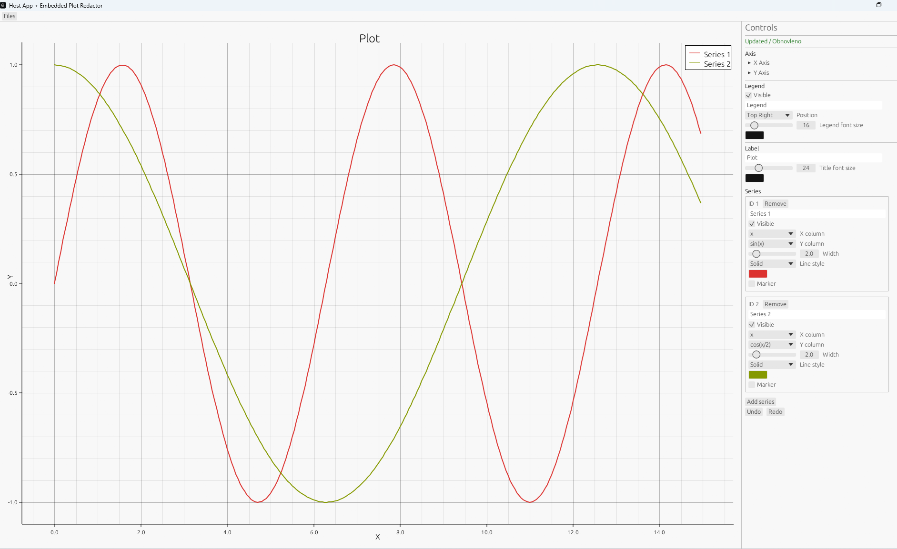

# KiThePlot

Tiny but functional plot redactor built with `egui` + `plotters`.

It can run as a standalone desktop app, and it can also be embedded into another Rust crate as a library component.



## What it does

- Imports numeric tabular data from:
  - CSV
  - TXT (whitespace separated)
- Displays interactive chart preview.
- Lets users fine tune plot configuration:
  - Axis labels, scale, min/max range
  - Major/minor ticks
  - Legend visibility, position, font size/color
  - Chart title + title font size/color
  - Series list with per-series controls:
    - visibility
    - x/y column mapping
    - line width/style/color
    - marker toggle
- Supports undo/redo for editing actions.
- Exports chart image with current design:
  - PNG
  - SVG

## Architecture (MVC)

- `model`: pure data structures and input parsing.
  - `DataSource` trait for host-provided data.
  - `DataTable` normalized internal table.
  - plot configuration types (`PlotModel`, axes, legend, series, styles).
- `view`: egui UI widgets. Emits typed actions.
- `controller`: validates actions, applies commands, manages undo/redo, import/export.

Dataflow:

`View -> Action -> Controller -> Model -> View`

## Standalone usage

```bash
cargo run
```

In the app:
- use `Files -> From CSV` or `Files -> From TXT`
- adjust chart settings from right panel
- use `Files -> Save as...` to export PNG/SVG

## Embedding as library

The crate exposes:

- `plot_redactor::PlotEditorApp`
- `plot_redactor::model::DataSource`
- `PlotController::load_from_data_source(&dyn DataSource)`

See full working example:

```bash
cargo run --example host_app
```

File: [examples/host_app.rs](examples/host_app.rs)

The example creates a custom host-side data source and injects it into the embedded editor.

## Public API sketch

```rust
use plot_redactor::PlotEditorApp;
use plot_redactor::model::DataSource;
```

- create `PlotEditorApp`
- call `app.controller_mut().load_from_data_source(...)`
- run inside your `eframe` host window

## Status

This project intentionally stays small and pragmatic: enough features to edit real plots, export results, and integrate into larger Rust GUI applications.


## License

This project is licensed under the MIT License - see the [LICENSE](LICENSE) file for details.
